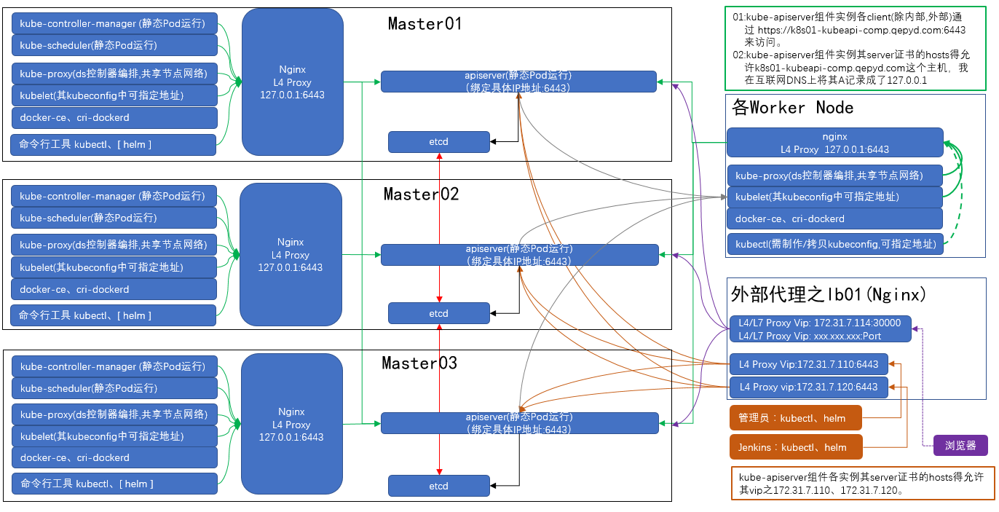

我的kubernetes学习环境使用的是kubeadm工具（官方）部署，实现了master的高可用，在实现高可用后，我做了一些改变（可看整体架构图）。

# 1.各node基本信息
```
root@master01:~#
root@master01:~# kubectl get nodes -o wide
NAME       STATUS   ROLES           AGE     VERSION   INTERNAL-IP    EXTERNAL-IP   OS-IMAGE             KERNEL-VERSION      CONTAINER-RUNTIME
master01   Ready    control-plane   2d20h   v1.24.3   172.31.7.201   <none>        Ubuntu 20.04.4 LTS   5.4.0-100-generic   docker://28.1.1
master02   Ready    control-plane   2d20h   v1.24.3   172.31.7.202   <none>        Ubuntu 20.04.4 LTS   5.4.0-100-generic   docker://28.1.1
master03   Ready    control-plane   2d20h   v1.24.3   172.31.7.203   <none>        Ubuntu 20.04.4 LTS   5.4.0-100-generic   docker://28.1.1
node01     Ready    <none>          2d20h   v1.24.3   172.31.7.204   <none>        Ubuntu 20.04.4 LTS   5.4.0-215-generic   docker://28.1.1
node02     Ready    <none>          2d20h   v1.24.3   172.31.7.205   <none>        Ubuntu 20.04.4 LTS   5.4.0-215-generic   docker://28.1.1
node03     Ready    <none>          2d20h   v1.24.3   172.31.7.206   <none>        Ubuntu 20.04.4 LTS   5.4.0-100-generic   docker://28.1.1
root@master01:~#
```

# 2.三条网络线
```
Pod网络：10.244.0.0/16
Svc网络：10.144.0.0/16
Node网络：172.31.0.0/16
```

# 3.安装有DNS插件、CNI插件
```
因为是由kubeadm工具部署的,其默认就会部署DNS插件之CoreDns。
其CNI插件我部署是flannel，用哪种软件产品实现，跟本文档没有任何的关系。
```

# 4.整体架构图


# 5.kube-apiserver的访问地址有
```
## 外部client
172.31.7.110、172.31.7.120
  #
  # 由kubernetes外部LB(例如Nginx)做了4层代理(后端节点即kube-apiserver组件实例的
  # 的地址及6443端口)。外部client（例如：kubectl）通过上述地址去连接kube-apiserver。
  # 例如1：https://172.31.7.110:6443   例如2：https://172.31.7.120:6443
  #

## 本地client
k8s01-kubeapi-comp.qepyd.com
  # 各node上其kubernetes的相关组件实例作为client时访问kube-apiserver的地址。
  # 此域名我在互联网DNS(只有这个条件)上将其解析成了127.0.0.1。
  # 各node上有LB(例如：Nginx)做4层代理(后端节点即kube-apiserver组件实例IP:6443
  #

## 内部client
kubernetes.default.svc.cluster.local
  #
  # k8s集群中各Pod
  #

## 注意
这些地址在kube-apiserver组件实例其server证书的hosts字段中是有允许(指定)。
openssl x509 -in /etc/kubernetes/pki/apiserver.crt -noout -text | grep -A 1 "X509v3 Subject Alternative Name"  
```
